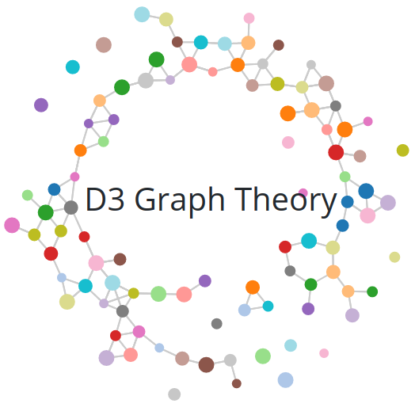

  

# D3 Graph Theory

> In mathematics, graph theory is the study of graphs, which are mathematical structures used to model pairwise relations between objects. A graph in this context is made up of vertices, nodes, or points which are connected by edges, arcs, or lines.
> -- <cite>Wikipedia</cite>

D3 Graph Theory is a front-end project aimed at anyone who wants to learn graph theory. It provides a quick and interactive introduction to the subject. The visuals used in the project makes it an effective learning tool.

## How to Use

Follow these steps:
1. Smile :smile:
2. Just <b><a href="https://mrpandey.github.io/d3graphTheory/" target="_blank">click here</a></b> to see it running in your browser.

## Topics Covered So Far

The whole content is broken in several units. So far these units have been added.

| Table | Of | Contents |
| --- | --- | --- |
|1. [Vertices and Edges](https://mrpandey.github.io/d3graphTheory/unit.html?vertices-and-edges)|2. [Order and Size of a Graph](https://mrpandey.github.io/d3graphTheory/unit.html?order-and-size)|3. [Degree of a Vertex](https://mrpandey.github.io/d3graphTheory/unit.html?degree-of-vertex)|
|4. [Degree Sequence of a Graph](https://mrpandey.github.io/d3graphTheory/unit.html?degree-sequence)|5. [Graphic Sequence](https://mrpandey.github.io/d3graphTheory/unit.html?graphic-sequence)|6. [Havel-Hakimi Algorithm](https://mrpandey.github.io/d3graphTheory/unit.html?havel-hakimi)|
|7. [Pigeonhole Principle](https://mrpandey.github.io/d3graphTheory/unit.html?pigeonhole)|8. [Regular Graph](https://mrpandey.github.io/d3graphTheory/unit.html?regular-graph)|9. [Complete Graph](https://mrpandey.github.io/d3graphTheory/unit.html?complete-graph)|
|10. [Bipartite Graph](https://mrpandey.github.io/d3graphTheory/unit.html?bipartite)|11. [Complete Bipartite Graph](https://mrpandey.github.io/d3graphTheory/unit.html?complete-bipartite)|12. [Walk](https://mrpandey.github.io/d3graphTheory/unit.html?walk)|
|13. [Open vs Closed Walks](https://mrpandey.github.io/d3graphTheory/unit.html?open-vs-closed)|14. [Connectivity](https://mrpandey.github.io/d3graphTheory/unit.html?connectivity)|15. [Eulerian Circuit](https://mrpandey.github.io/d3graphTheory/unit.html?eulerian-circuit)|
|16. [Eulerian Trail](https://mrpandey.github.io/d3graphTheory/unit.html?eulerian-trail)|17. [Graph Coloring](https://mrpandey.github.io/d3graphTheory/unit.html?graph-coloring)|18. [k-Colorable Graph](https://mrpandey.github.io/d3graphTheory/unit.html?k-colorable)|
|19. [Chromatic Number](https://mrpandey.github.io/d3graphTheory/unit.html?chromatic-number)|20. [Trees](https://mrpandey.github.io/d3graphTheory/unit.html?trees)|21. [Rooted Trees](https://mrpandey.github.io/d3graphTheory/unit.html?rooted-trees)|
|22. [Spanning Tree of a Graph](https://mrpandey.github.io/d3graphTheory/unit.html?spanning-tree)|

The project is still expanding. New topics are added from time to time.

## Upcoming Topics

These topics are planned to be added.

- [x] Chromatic Number
- [x] Trees
- [x] Rooted Trees
- [x] Spanning Tree
- [ ] Prim's Algorithm
- [ ] Kruskal's Algorithm

So, keep checking for updates. :smile:

## Attributions

This project is built with the help of following libraries and projects.

* [D3.js](https://github.com/d3/d3)
* [MathJax](https://github.com/mathjax/MathJax)
* [JQuery](https://github.com/jquery/jquery)
* [Bootstrap](https://github.com/twbs/bootstrap)
* [Modal Logic Playground](https://github.com/rkirsling/modallogic)
* [Havel-Hakimi](https://github.com/jacquerie/hh)
* [iconsanscoffee.com](http://iconsandcoffee.com/)
* [GitHub Buttons](https://ghbtns.com/)

## License

Copyright (c) 2017-18 Avinash Pandey.
All the contents of this repository is bound by [GNU GPLv3 License](https://github.com/mrpandey/d3graphTheory/blob/master/LICENSE).
