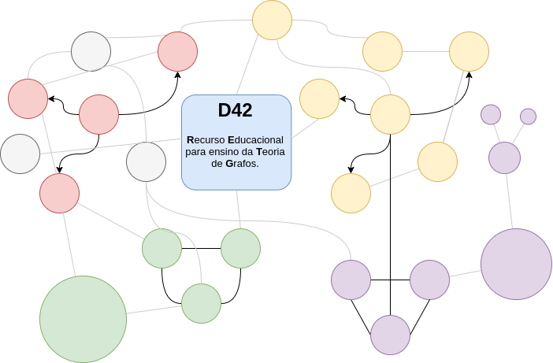

  

# D42 Introdução a Teoria de Grafos

D42 (*Degree 42*) é um recurso Educacional para introdução a teoria de grafos.
Este projeto é um fork do projeto de código aberto [D3 Graph Theory](https://github.com/mrpandey/d3graphTheory).
O seu conteúdo foi traduzido para português (PT-BR), com o intuito de ser utilizado
como recurso educacional para introdução a teoria de grafos em estágio em docência na disciplina de
Matemática Discreta na UFSJ.

## Licença

## Licença Original

Copyright (c) 2017 [Avinash Pandey](http://mrpandey.com). Licensed under [MIT License](https://github.com/mrpandey/d3graphTheory/blob/master/LICENSE).
