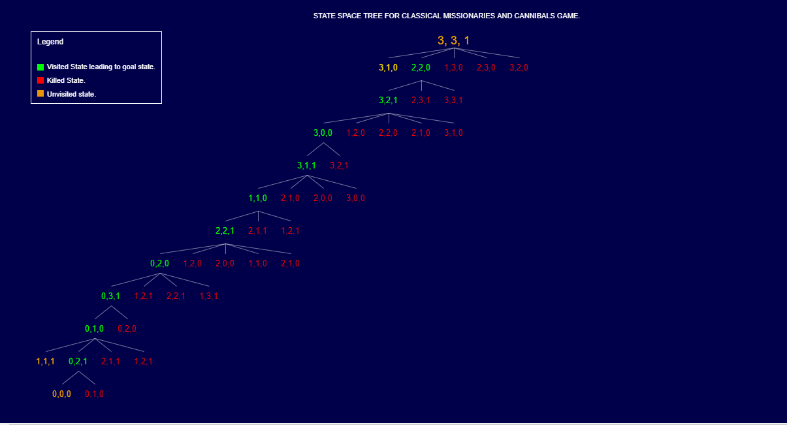
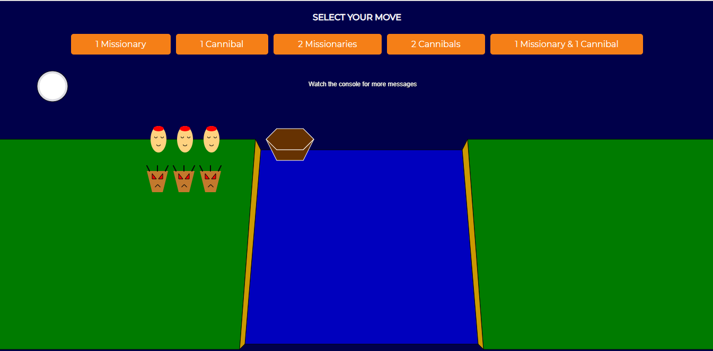

# Missionaries-and-Cannibals-Game

Using AI for playing the classical Missionaries and Cannibals Game.

# ScreenShots

  
   
  
  

# Graphics Library 

JavaScript Library - p5.js

# Description

In the missionaries and cannibals problem, three missionaries and three cannibals must cross a river using a boat which can carry at most two people, under the constraint that, for both banks, if there are missionaries present on the bank, they cannot be outnumbered by cannibals (if they were, the cannibals would eat the missionaries). The boat cannot cross the river by itself with no people on board. And, in some variations, one of the cannibals has only one arm and cannot row.
 
<i>Source: Wikipedia </i>
